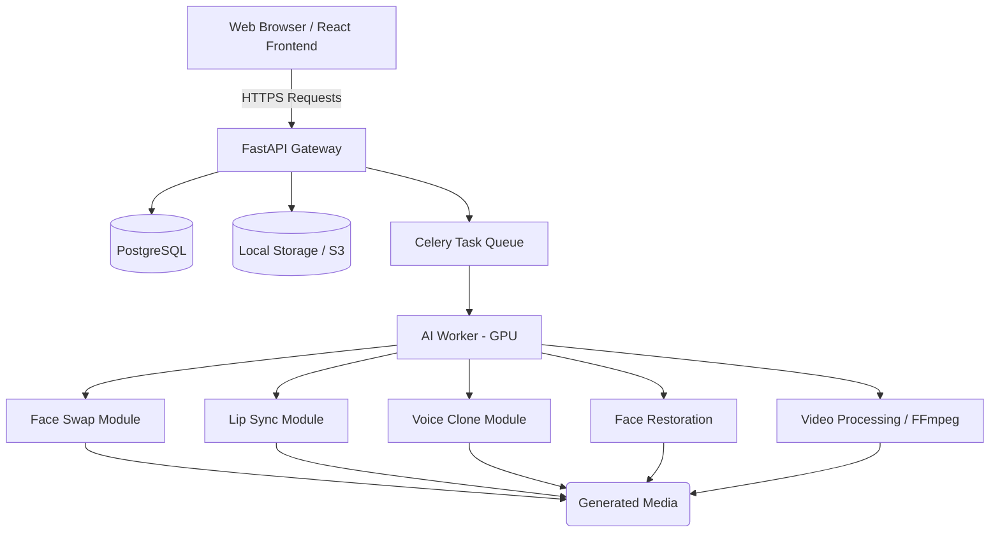
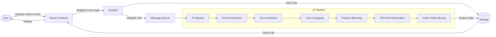
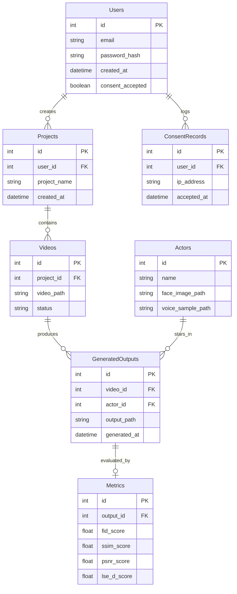

# System Architecture & Design

## 1. System Architecture Diagram

```mermaid
graph TD
    Client[Web Browser / React Frontend] -->|HTTPS Requests| API[FastAPI Gateway]
    
    API --> DB[(PostgreSQL)]
    API --> FileStorage[(Local Storage / S3)]
    
    API --> TaskQueue[Celery Task Queue]
    TaskQueue --> Worker1[AI Worker - GPU]
    
    Worker1 --> FaceSwap[Face Swap Module]
    Worker1 --> LipSync[Lip Sync Module]
    Worker1 --> VoiceClone[Voice Clone Module]
    Worker1 --> Restoration[Face Restoration]
    Worker1 --> FFmpeg[Video Processing / FFmpeg]
    
    FaceSwap --> OutputGen(Generated Media)
    LipSync --> OutputGen
    VoiceClone --> OutputGen
    Restoration --> OutputGen
    FFmpeg --> OutputGen
```

## 2. Data Flow Diagram

```mermaid
flowchart LR
    User([User]) -->|Uploads Video & Face| UI[React Frontend]
    UI -->|Multipart Form Data| Backend[FastAPI]
    Backend -->|Save File| Storage[(Storage)]
    Backend -->|Dispatch Job| Queue[Message Queue]
    Queue --> Core[AI Pipeline]
    
    subgraph AI Pipeline
        Core --> Extract[Frame Extraction]
        Extract --> Det[Face Detection]
        Det --> Swap[Face Swapping]
        Swap --> Blend[Poisson Blending]
        Blend --> Restore[GFPGAN Restoration]
        Restore --> Merge[Audio-Video Muxing]
    end
    
    Merge -->|Output Video| Storage
    Storage -->|Serve File| UI
    UI -->|Display| User
```

## 3. Entity Relationship Diagram (ERD)

```mermaid
erDiagram
    Users {
        int id PK
        string email
        string password_hash
        datetime created_at
        boolean consent_accepted
    }
    
    Projects {
        int id PK
        int user_id FK
        string project_name
        datetime created_at
    }
    
    Videos {
        int id PK
        int project_id FK
        string video_path
        string status
    }
    
    Actors {
        int id PK
        string name
        string face_image_path
        string voice_sample_path
    }
    
    GeneratedOutputs {
        int id PK
        int video_id FK
        int actor_id FK
        string output_path
        datetime generated_at
    }
    
    Metrics {
        int id PK
        int output_id FK
        float fid_score
        float ssim_score
        float psnr_score
        float lse_d_score
    }
    
    ConsentRecords {
        int id PK
        int user_id FK
        string ip_address
        datetime accepted_at
    }

    Users ||--o{ Projects : creates
    Users ||--o{ ConsentRecords : logs
    Projects ||--o{ Videos : contains
    Videos ||--o{ GeneratedOutputs : produces
    Actors ||--o{ GeneratedOutputs : stars_in
    GeneratedOutputs ||--o| Metrics : evaluated_by
```
